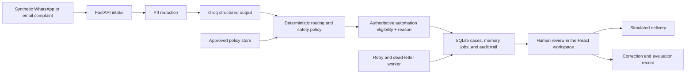

# Kora architecture

Kora is a portfolio demonstration of an inspectable support-triage workflow. The public deployment uses synthetic data, demo authentication, and simulated outbound delivery. It is not connected to a real support operation.

## Request path

1. A synthetic complaint enters through the demo interface or an inbound adapter.
2. FastAPI validates the request and removes phone numbers, email addresses, full account numbers, names, and sensitive details in stored notes before model use.
3. Groq returns schema-constrained intent, urgency, sentiment, entities, evidence, and a response draft.
4. Deterministic Python policy normalises routing and urgency, then blocks sensitive-data requests, invented external actions, unsafe automation, and low-confidence decisions.
5. SQLite persists the case, customer memory, decision, policy overrides, job state, and human action.
6. The React workspace keeps the original message, machine assessment, evidence, and human decision together.

## Implemented boundaries

- `backend/app/main.py`: builds the app: lifecycle, middleware and router registration.
- `backend/app/api/routers/`: one module per API area (cases, case actions, policies, proof runs, operations, evaluations, webhooks, system).
- `backend/app/api/deps.py`: shared state and dependencies (auth, rate limits, AI budget). `api/webhook_auth.py` verifies provider webhooks.
- `backend/app/service.py`: redacted model request, policy application, persistence, and audit creation.
- `backend/app/groq_triage.py`: schema-constrained model integration.
- `backend/app/triage_policy.py` and `backend/app/guardrails.py`: deterministic operational and safety decisions.
- `backend/app/automation.py`: the single automation-eligibility authority. It emits a stable `eligible`, `reason`, and `code` record consumed by persistence, delivery, queue metrics, and actions.
- `backend/app/workflow.py`: idempotent inbound processing, retries, dead-letter handling, and simulated delivery.
- `backend/app/database/`: tenant-scoped SQLite persistence, one repository per domain (cases, messages, jobs, audit, workspace), plus schema and in-place migrations.
- `src/App.jsx`: support queue, human review, proof mode, settings, and audit interface.

## Automation policy boundary

Automation eligibility is evaluated once in the backend after model output,
operational policy, guardrails, approved-policy matching, information checks,
and delivery readiness are known. The result is written to both the triage audit
event and the ticket projection. React displays that recorded result; it does
not reproduce the safety rules.

The workflow worker reads the typed eligibility result to decide whether to
enqueue delivery. Bulk approval also asks the API to require recorded
eligibility, and the API fails closed when the decision is missing, malformed,
or ineligible. Legacy tickets are backfilled as `not_evaluated`, never inferred
as safe.

## Demo boundary

The public demo intentionally uses one SQLite-backed application instance, synthetic cases, and demo authentication. Postmark, WhatsApp Cloud API, Paystack verification, and live delivery adapters exist in code but are not evidence of production use. See [limitations](limitations.md) for the remaining gaps.
